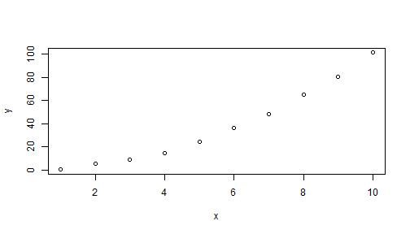
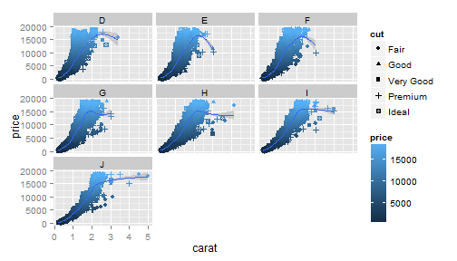
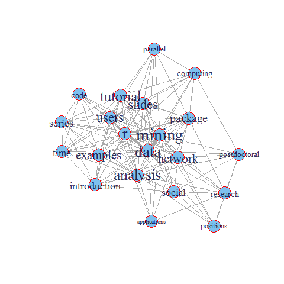
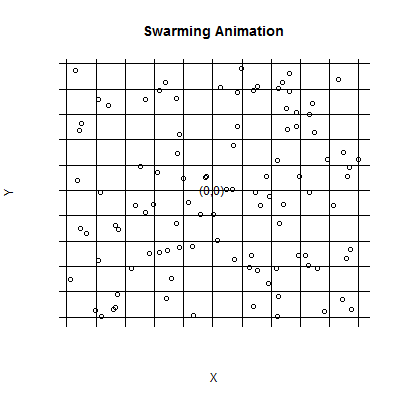
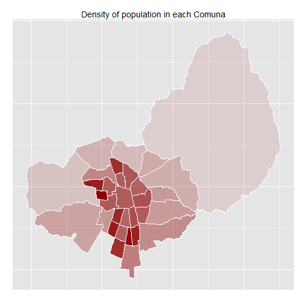

## Aclaración
<br>
Las opiniones vertidas en esta presentación son de exclusiva responsabilidad del autor de esta
y representan necesariamente el pensamiento del mismo.


---  bg:white
## Agenda
<br>

> 1. Lo básico

> 2. Lo no tan básico

> 3. Lo quizás avanzado

> 4. Donde podemos ver R en acción?

---  
## Lo Básico I
<br>

#### Alguien dijo sumar? (menos mal!)


```r
5 + 5
```

```
## [1] 10
```


#### Alguien dijo vectores? (yeah!)


```r
v <- c(1, 2, 3)
t <- seq(1, 7, by = 3)
v * t
```

```
## [1]  1  8 21
```


---  
## Lo Básico II
<br>
####  Creación de tablas? (obvio! como no?)


```r
tabla <- data.frame(columna1 = c("hola", "que", "hace?"),
                    otra_columna = c(3,4,5))
str(tabla)
```

```
## 'data.frame':	3 obs. of  2 variables:
##  $ columna1    : Factor w/ 3 levels "hace?","hola",..: 2 3 1
##  $ otra_columna: num  3 4 5
```


####  Lectura de datos? (obvio! * obvio!)<br>
Distintas tipos de fuentes, texto, excel, motores de bases de datos como myslq, etc! ;)


---  
## Lo Básico III
<br>
#### Gráficos! (mmm...)

```r
x <- 1:10
y <- x^2 + rnorm(length(x))
plot(x, y)
```

 


---  
## Lo no tan básico I
<br>
#### Más gráficos con ayuda de [***ggplot2***](http://ggplot2.org/) (muy fome el anteior)


```r
ggplot(data = diamonds) + geom_point(aes(x = carat, y = price, color = price, 
    shape = cut)) + geom_smooth(aes(x = carat, y = price)) + facet_wrap(~color)
```

 


---  
## Lo no tan básico II
<br>
#### Reportería, o esta presentacón!


---  
## Quizás lo avanzado I
<br>
#### Y más gráficos con auspicio de [googleVis](http://code.google.com/p/google-motion-charts-with-r) (por que no html?)

```r
M <- gvisMotionChart(Fruits, "Fruit", "Year", options = list(width = 500, height = 300))
```

<!-- MotionChart generated in R 3.0.0 by googleVis 0.4.2 package -->
<!-- Sat May 11 11:44:24 2013 -->


<!-- jsHeader -->
<script type="text/javascript">
 
// jsData 
function gvisDataMotionChartID15345ab54198 () {
  var data = new google.visualization.DataTable();
  var datajson =
[
 [
 "Apples",
2008,
"West",
98,
78,
20,
"2008-12-31" 
],
[
 "Apples",
2009,
"West",
111,
79,
32,
"2009-12-31" 
],
[
 "Apples",
2010,
"West",
89,
76,
13,
"2010-12-31" 
],
[
 "Oranges",
2008,
"East",
96,
81,
15,
"2008-12-31" 
],
[
 "Bananas",
2008,
"East",
85,
76,
9,
"2008-12-31" 
],
[
 "Oranges",
2009,
"East",
93,
80,
13,
"2009-12-31" 
],
[
 "Bananas",
2009,
"East",
94,
78,
16,
"2009-12-31" 
],
[
 "Oranges",
2010,
"East",
98,
91,
7,
"2010-12-31" 
],
[
 "Bananas",
2010,
"East",
81,
71,
10,
"2010-12-31" 
] 
];
data.addColumn('string','Fruit');
data.addColumn('number','Year');
data.addColumn('string','Location');
data.addColumn('number','Sales');
data.addColumn('number','Expenses');
data.addColumn('number','Profit');
data.addColumn('string','Date');
data.addRows(datajson);
return(data);
}
 
// jsDrawChart
function drawChartMotionChartID15345ab54198() {
  var data = gvisDataMotionChartID15345ab54198();
  var options = {};
options["width"] =    500;
options["height"] =    300;

     var chart = new google.visualization.MotionChart(
       document.getElementById('MotionChartID15345ab54198')
     );
     chart.draw(data,options);
    

}
  
 
// jsDisplayChart
(function() {
  var pkgs = window.__gvisPackages = window.__gvisPackages || [];
  var callbacks = window.__gvisCallbacks = window.__gvisCallbacks || [];
  var chartid = "motionchart";

  // Manually see if chartid is in pkgs (not all browsers support Array.indexOf)
  var i, newPackage = true;
  for (i = 0; newPackage && i < pkgs.length; i++) {
    if (pkgs[i] === chartid)
      newPackage = false;
  }
  if (newPackage)
    pkgs.push(chartid);

  // Add the drawChart function to the global list of callbacks
  callbacks.push(drawChartMotionChartID15345ab54198);
})();
function displayChartMotionChartID15345ab54198() {
  var pkgs = window.__gvisPackages = window.__gvisPackages || [];
  var callbacks = window.__gvisCallbacks = window.__gvisCallbacks || [];
  window.clearTimeout(window.__gvisLoad);
  // The timeout is set to 100 because otherwise the container div we are
  // targeting might not be part of the document yet
  window.__gvisLoad = setTimeout(function() {
    var pkgCount = pkgs.length;
    google.load("visualization", "1", { packages:pkgs, callback: function() {
      if (pkgCount != pkgs.length) {
        // Race condition where another setTimeout call snuck in after us; if
        // that call added a package, we must not shift its callback
        return;
      }
      while (callbacks.length > 0)
        callbacks.shift()();
    } });
  }, 100);
}
 
// jsFooter
 </script>
 
<!-- jsChart -->  
<script type="text/javascript" src="https://www.google.com/jsapi?callback=displayChartMotionChartID15345ab54198"></script>
 
<!-- divChart -->
  
<div id="MotionChartID15345ab54198"
  style="width: 500px; height: 300px;">
</div>


---  
## Quizás lo avanzado II
<br>
#### Más más gráficos con [rNVD3](https://github.com/ramnathv/rNVD3) (por que no más html?)

<script src="http://ajax.googleapis.com/ajax/libs/jquery/1.8.3/jquery.min.js"></script>
<script src="http://d3js.org/d3.v2.min.js"></script>
<script src="http://nvd3.org/nv.d3.js"></script>
<script src="http://nvd3.org/lib/fisheye.js"></script>
<script src="http://raw.github.com/novus/nvd3/master/src/models/scatterPlusLineChart.js"></script>
  


```r
bar <- nvd3Plot( ~ day | sex, data = tips, type = 'multiBarChart', width=800, height=300)
```


<div id='barChart' class='nvd3Plot'></div>
<script type='text/javascript'>
    drawbarChart()
    function drawbarChart(){  
      var opts = {"id":"barChart","yAxis":[],"x":"day","y":"freq","group":"sex","type":"multiBarChart","width":800,"height":300},
        data = [{"day":"Fri","sex":"Female","freq":9},{"day":"Fri","sex":"Male","freq":10},{"day":"Sat","sex":"Female","freq":28},{"day":"Sat","sex":"Male","freq":59},{"day":"Sun","sex":"Female","freq":18},{"day":"Sun","sex":"Male","freq":58},{"day":"Thur","sex":"Female","freq":32},{"day":"Thur","sex":"Male","freq":30}]
  
      var data = d3.nest()
        .key(function(d){
          return opts.group === undefined ? 'main' : d[opts.group]
        })
        .entries(data)
      
      nv.addGraph(function() {
        var chart = nv.models[opts.type]()
          .x(function(d) { return d[opts.x] })
          .y(function(d) { return d[opts.y] })
          .width(opts.width)
          .height(opts.height)
         
        
          
        
        
        
      
       d3.select("#" + opts.id)
        .append('svg')
        .datum(data)
        .transition().duration(500)
        .call(chart);

       nv.utils.windowResize(chart.update);
       return chart;
      });
    };
</script>


---  
## Quizás lo avanzado III
<br>
#### Lo que está de moda, crear aplicaciones web con shiny
<br>

##### 1. [Dónde nos juntamos?](http://jean-robert.github.io/metro.html)
<br>

##### 2. [Creacion de documentos](http://glimmer.rstudio.com/ropensci/knitr/)
<br>

##### 2. [Que se ve mas en la TV?](http://glimmer.rstudio.com/pssguy/TVShowRatings/)
<br>


---  
## Ya, y? Que más?
 


---  
## Textmining con tinte de SNA

<br>
[An Example of Social Network Analysis with R using Package igraph](http://rdatamining.wordpress.com/2012/05/17/an-example-of-social-network-analysis-with-r-using-package-igraph/)


--- 
## Simulacion de Enjambres

<br>
[Spatial Critter Swarming Simulation](http://www.econometricsbysimulation.com/2013/05/spatial-critter-swarming-simulation.html)


---  
## Analisis Espacial en geografía

<br>
[A brief script geographical data analysis r](http://jkunst.com/post/brief-script-geographical-data-analysis-r/)


---  
## Se pueden realizar varias cosas, no?


---  
## Referencias
<br>
 1. [Knitr](http://yihui.name/knitr/), Elegant, flexible and fast dynamic report generation with R; Yihui Xie.
 2. [Slidify](http://ramnathv.github.io/slidify/); Stunning presentations from Markonw; Ramnath Vaidyanathan.
 3. [Ggplot2](http://ggplot2.org/); An implementation of the Grammar of Graphics; Hadley Wickham


